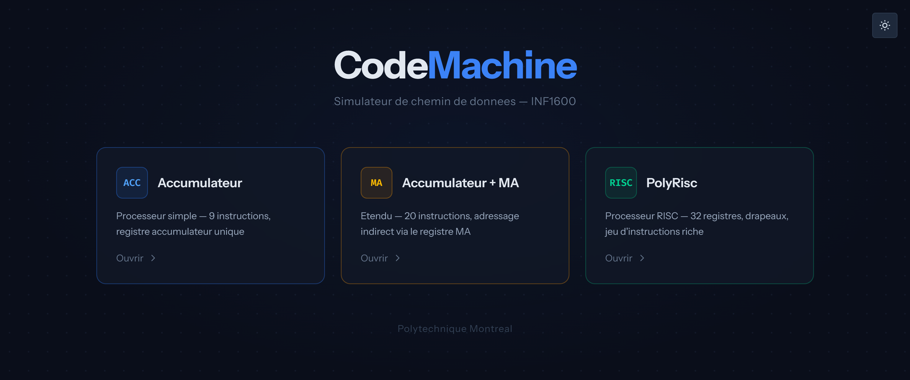

# CodeMachine v3

Simulateur de chemin de donnees pour **INF1600** a Polytechnique Montreal. Permet d'ecrire de l'assembleur, de le compiler et de visualiser l'execution cycle par cycle sur le circuit du processeur.

<!-- Screenshot de la page d'accueil -->


---

## Fonctionnalites

- Editeur assembleur (CodeMirror 6) avec coloration syntaxique et diagnostics
- Visualisation du circuit : signaux actifs et bus mis en surbrillance a chaque cycle
- Panneau memoire (HEX/DEC) et panneau registres
- Navigation cycle par cycle (avant, arriere, debut, fin)
- Reference du jeu d'instructions dans un tiroir lateral
- Theme clair / sombre (persiste en localStorage)
- Panneaux redimensionnables, zoom et panoramique sur le circuit

## Processeurs supportes

| Processeur | Instructions | Registres |
|---|---|---|
| **Accumulateur** | 10 | ACC |
| **Accumulateur + MA** | 21 | ACC, MA |
| **PolyRisc** | 17 | 32 registres + drapeaux Z, N |

---

## Captures d'ecran

### Espace de travail — Mode sombre

<!-- Screenshot du workspace en mode sombre avec du code compile et le circuit actif -->


### Espace de travail — Mode clair

<!-- Screenshot du workspace en mode clair -->


### Visualisation du circuit

<!-- Screenshot en zoom sur le circuit avec des signaux actifs (fils rouges/verts) -->


### Reference d'instructions

<!-- Screenshot du tiroir lateral d'instructions ouvert -->


---

## Architecture technique

```
code-machine-v2/
├── simulator/          # Backend Rust compile en WebAssembly
│   └── src/
│       ├── compiler/   # Compilation assembleur → programme
│       ├── engine/     # Moteurs de simulation par processeur
│       └── lib.rs      # Interface WASM (wasm-bindgen)
├── frontend/           # Application SolidJS
│   ├── src/
│   │   ├── components/ # Composants UI (editeur, circuit, memoire, etc.)
│   │   ├── pages/      # Pages (Home, Workspace)
│   │   ├── stores/     # Etats globaux (simulation, theme)
│   │   └── wasm/       # Bridge TypeScript ↔ WASM
│   └── electron/       # Configuration Electron (app bureau)
└── docs/               # Documentation et ressources
```

### Stack technique

| Couche | Technologie | Role |
|---|---|---|
| Simulation | **Rust** → **WebAssembly** | Compilation assembleur, execution cycle par cycle |
| Interface | **SolidJS** + **TypeScript** | Rendu reactif, gestion d'etat |
| Style | **Tailwind CSS v4** | Theme clair/sombre, composants responsifs |
| Editeur | **CodeMirror 6** | Coloration syntaxique, diagnostics, raccourcis |
| Bureau | **Electron** | Distribution multiplateforme (Windows, macOS, Linux) |

---

## Installation et developpement

### Prerequis

- [Rust](https://rustup.rs/) (stable)
- [wasm-pack](https://rustwasm.github.io/wasm-pack/installer/)
- [Node.js](https://nodejs.org/) >= 18
- npm

### Compiler le simulateur WASM

```bash
cd simulator
wasm-pack build --target web --dev
```

### Lancer le frontend en developpement

```bash
cd frontend
npm install
npm run dev
```

L'application sera accessible a `http://localhost:5173`.

### Construire pour la production

```bash
# Compilation WASM optimisee
cd simulator
wasm-pack build --target web --release

# Build frontend + packaging Electron
cd frontend
npm run build
npx electron-builder
```

Les executables sont generes dans `frontend/release/`.

### Lancer les tests

```bash
cd frontend
npm test           # Execution unique
npm run test:watch # Mode surveillance
```

---

## Raccourcis clavier

| Raccourci | Action |
|---|---|
| `Ctrl + Entree` | Compiler le code |
| `Espace` | Lecture / pause |
| `Fleche droite` | Cycle suivant |
| `Fleche gauche` | Cycle precedent |
| `Home` | Retour au debut |
| `End` | Aller a la fin |
| `Molette` | Zoom sur le circuit |
| `Alt + clic` | Panoramique du circuit |

---

## Convention de commits

Les commits suivent le format :

```
<type>(<portee>): <description courte>
```

| Type | Usage |
|---|---|
| `feat` | Fonctionnalite ou ajout |
| `fix` | Correction de bug |
| `style` | Formatage, mise en page |
| `refactor` | Reusinage du code |
| `doc` | Documentation |
| `test` | Ajout ou modification de tests |
| `chore` | Maintenance, dependances |

---

## Licence

Voir [LICENSE](LICENSE).
